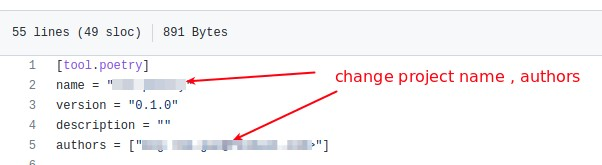

========
Overview
========

This project is used as a python project / library template. It solves the problem that how we
can quickly build a new business-oriented python project with modern python management tools or libs.
The project provides below basic dev env tools:

* python version and virtual env installation and management
* python dependencies management
* linting and formatting routines
* unit-testing tools, coverage reports, test automation tools
* a matured file structure for both source code and tests
* pre-commit configurations and github actions integrated with test automation tools
* a matured docstring examples, documentation examples, and their generation tool

.. start-badges

.. image:: https://img.shields.io/badge/python-3.8-blue
   :target: https://github.com/m0ga0/python-project-template

.. image:: https://codecov.io/gh/m0ga0/python-project-template/branch/main/graph/badge.svg?token=4XEHN8HP94
   :target: https://codecov.io/gh/m0ga0/python-project-template

.. image:: https://github.com/m0ga0/python-project-template/workflows/main-pipeline/badge.svg
   :target: https://github.com/m0ga0/python-project-template/actions?query=workflow%3Amain-pipeline

.. end-badges

Pre-required installation
=========================
We will start to setup some development tools in this section, in order to manage a python project.

Install pyenv
-------------
pyenv helps setup multiple python versions in the developing system.

* If you haven't installed pyenv yet, please refer to
  `pyenv installation <https://github.com/pyenv/pyenv#installation>`_.
* If you already have a older version of pyenv, and you want to update it to the latest
  version, please refer to `pyenv-update <https://github.com/pyenv/pyenv-update>`_ tool.

Install poetry
--------------
While pip (already installed, if not, refer to `pip installation <https://pip.pypa.io/en/stable/installation/>`_) is
a tool to install python packages. We still need a tool to manage python package dependencies for a project.
`Poetry <https://python-poetry.org/>`_ is a modern python project management and dependencies resolving tool::

    curl -sSL https://raw.githubusercontent.com/python-poetry/poetry/master/install-poetry.py | python -
    poetry --version

PS: don't forget to add poetry bin into your $PATH and ~/.bashrc, more details please follow poetry instructions.

Install tox
-----------
In order to run test env management tool, you need install tox::

    pip install tox

Install pre-commit
------------------
To trigger linting and formatting, you should install pre-commit::

    pip install pre-commit
    pre-commit install

(Optional) Install restructuredtext extention for VS code
---------------------------------------------------------
In order to edit reStructuredText documentations, please refer to `reStructuredText extension <https://docs.restructuredtext.net/>`_

Template Usage
==============
Source file structure
---------------------
The strongly suggested you organize your code structure like below::

    ├─ setup.py
    ├─ src/
    |   ├─ mypkg/
    |       ├─ __init__.py
    |       ├─ app.py
    |       ├─ view.py
    ├─ tests/
        ├─ __init__.py
        ├─ foo/
        |   ├─ __init__.py
        |   ├─ test_view.py
        ├─ bar/
            ├─ __init__.py
            ├─ test_view.py

This can allow pytest to load modules whose file name can be the same (in above example both named test_view.py), meanwhile
tools like tox will only test the mypkg you installed via ``poetry install``.

Install a specific python version
---------------------------------
After you decide which python version to use, first install it via pyenv::

    pyenv install 3.8.12    # you can use
    pyenv virtualenv 3.8.12 venv-project-x  # define a virtualenv with an installed python version
    pyenv local venv-project-x  # use the virtualenv for current dir

You can test current python version by::

    pyenv version

or::

    python -V

Upgrade pip
-----------
::

    pip install --upgrade pip

Create a new project from this template
----------------------------------------
Since this project is a repo template, you can use it to create a new python project:

* click "Use this template" button on the top right corner
* select an account in the owner drop down
* type the name of your new project repo, choose it's public or private
* click "repository from template" button.

Start edit the new project
--------------------------
::

    git clone <project repo>

Config pyproject.toml
---------------------
pyproject.toml is a project config file managing its version, python version, dev / prod dependencies,
build system, exposed commands and other configs. Modify this file like below:

Install dev-dependencies
------------------------
Below command will read the current poetry.lock file in the current directory (or pyproject.toml),
and install all libraries into poetry's own virtualenv::

    poetry install

Add new dependencies
--------------------
When developing your own project, add new external libraries using below command

* If you want to add *develop* dependencies::

    poetry add -D <new pip package>

* Or if you want to add *prod* dependencies::

    poetry add <new pip package>

When Poetry has finished installing, it writes all of the packages and the exact versions
of them that it downloaded to the poetry.lock file, locking the project to those specific
versions. You should commit the poetry.lock file to your project repo so that all people
working on the project are locked to the same versions of dependencies. (More details:
`poetry lock <https://python-poetry.org/docs/basic-usage/#installing-with-poetrylock>`_)

Run tests
---------
To run through unit-tests in test env management tool like tox, you can do below::

    tox

or if you want to run a paticular testenv in tox.ini::

    tox -e <env name1> <env name2>

To run simple scripts or unit-tests like pytest in specified virtual env, use below commands::

    poetry run python <your scripts>.py
    poetry run pytest   # run external commands

Poetry will rirst create a virtual env as per your config and dependencies in pyproject.toml,
and then run your scripts.

If you want to run more commands in the your specific developing virtual env, you can type::

    poetry shell

This will start a new shell with the virtual env, and you can run whatever commands you want.
(More details: `poetry env <https://python-poetry.org/docs/basic-usage/#using-your-virtual-environment>`_)

Generate coverage report
------------------------
If you run tests with tox, you will find coverage report is one of its testenv. You can generate test
coverage report by::

    tox -e coverage

Pre-commit check and fox
------------------------
When you run ``git commit``, pre-commit hooks will be automatically triggered because we have setup pre-commit-config.yaml file.
If you want to debug or repro some check failure, you can run below commands::

    pre-commit run --all-files --show-diff-on-failure

Generate documentation
----------------------
This project use sphinx to generate documentations. Go to docs/source/conf.py, change ``project``, ``author`` and ``release``,
then you can start write your doc from index.rst. When you've done, run below command to build the docs::

    cd docs
    poetry run make html

html files will be created in build/ folder. As per how to write a good documentation, please check next section.

Write docs and comments
=======================
Use one of below code styles for docstrings:

* `Google style <https://sphinxcontrib-napoleon.readthedocs.io/en/latest/example_google.html#example-google>`_
* `NumPy style <https://sphinxcontrib-napoleon.readthedocs.io/en/latest/example_numpy.html#example-numpy>`_

Use markdown or reStructuredText language for other documentations

Contribute
==========
Remember to put your own project name below:

* Issue Tracker: github.com/<project>/<project>/issues
* Source Code: github.com/<project>/<project>

Support
=======
If you are facing issues, please let us know via email mo.gao@foxmail.com

License
=======
MIT license
